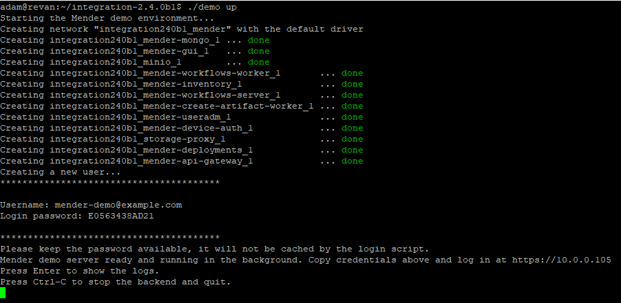
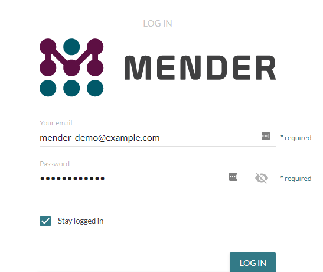
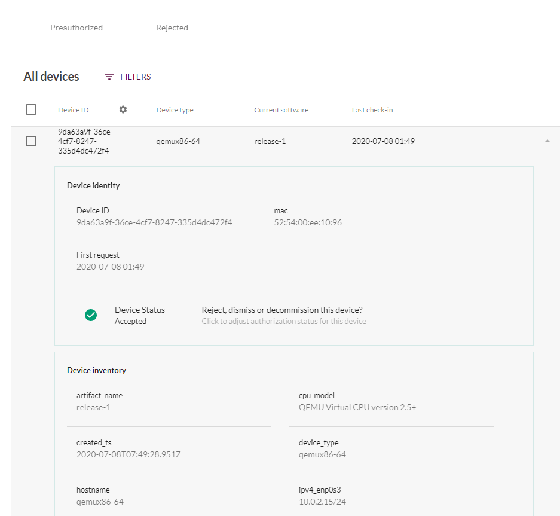
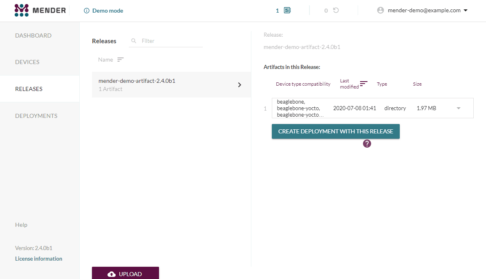
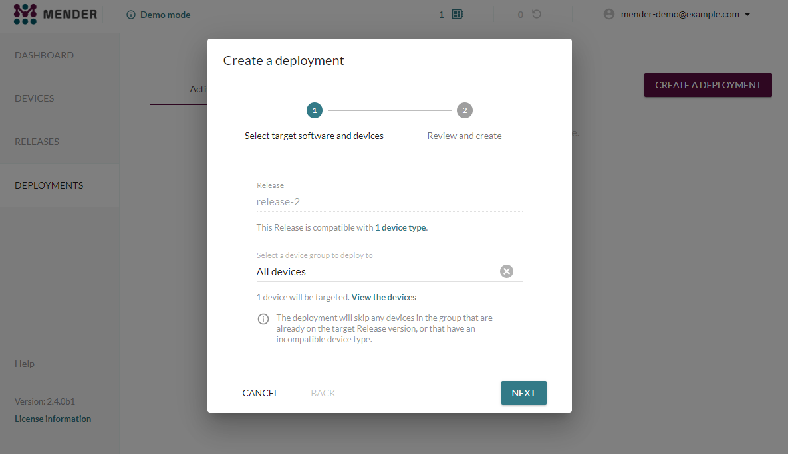
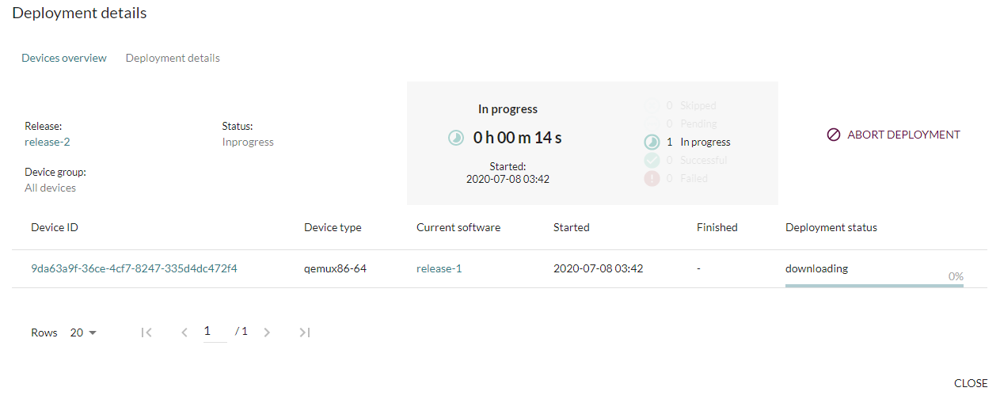
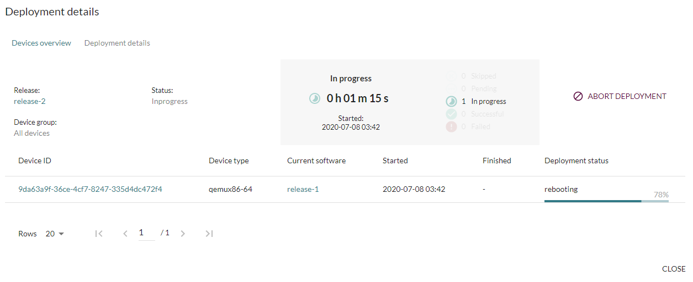
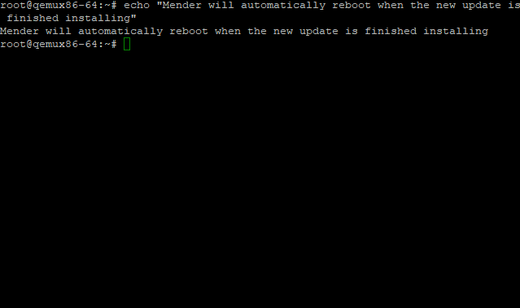
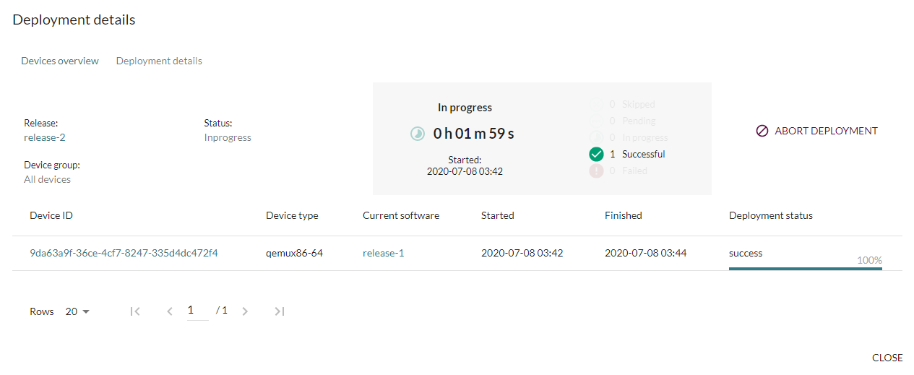

# Yocto BSP Firmware Updates Using Mender

Firmware updates on barebones Linux distributions have always been cumbersome.  SOC manufacturers often roll their own uboot scripts that vary from platform to platform, rolling ones own software update package is time consuming, and you're out of luck if you want cloud updates.

Arriving to fill this gap, [Mender](https://mender.io) is a Yocto-compatible software package that provides a robust firmware update solution that is scalable from single developer, multi-developer, to cloud-deployable use cases.  It is open-source software with community support for several common embedded Linux [boards](https://hub.mender.io/c/board-integrations/6), and is customizable enough to add support to any project built in Yocto.

To demonstrate the out-of-the-box capabilities of Mender, I've put together a demo running a host on a local PC and an emulated client running in a QEMU VM.

## Setup

This tutorial will use version 2.4 of [Mender](https://docs.mender.io/2.4).  When deploying this to a real product, you will need to select a version of Mender that's right for your project.  Generally speaking, this should be the latest version with support targeting your project's version of [Yocto](https://wiki.yoctoproject.org/wiki/Releases).

### Mender Server

Mender provides a [Demo Server](https://docs.mender.io/2.4/getting-started/on-premise-installation/create-a-test-environment) for easy use in non-production environments.  Be sure to open the required ports 443 and 9000 on your firewall if your machine uses one.
For additional details on using the server, see the documentation.

Start by cloning the demo server repository and changing to that directory:

```bash
git clone -b 2.4.0b1 https://github.com/mendersoftware/integration.git integration-2.4.0b1
cd integration-2.4.0b1
```

By default, the server runs on the `localhost` interface; however, `localhost` is not visible to the QEMU instance.  This requires routing the server to a physical interface address.  Open the `demo` file, locate the `MENDER_SERVER_URI` variable, and change it to `https://**YOUR_IP_ADDRESS**`, e.g. `MENDER_SERVER_URI=10.0.0.105`.

Start the demo by executing `./demo up`.  As the docker stack boots, a username and password will be printed to the screen.  Copy this for later, as you will use this to log in to your Mender server.



Now that the server is running, navigate to `https://**YOUR_IP_ADDRESS**`, ignore the invalid certificate warning, and log in to the Mender server. 



### Mender Client

The full project is located on [Github](https://github.com/PseudoDesign/mender-demo).  The project is based on my go-to implementation of Dockerized OpenEmbedded builds.  See the `README.md` file for more details, or just run `rake -T` to see what you can do with it.

This demo will run Mender in a [QEMU](https://www.qemu.org/) environment.  This will allow demonstration of Mender capabilities without having to deal with any physical hardware.  

This demo is targeting Yocto Warrior using a qemux86-64 machine.

Given the limited needs of this project, it does not necessitate many OpenEmbedded meta layers.  They've been added as git submodules in the `.../sources` directory; you can find details on the layers in the links below.

* [Yocto Poky](https://www.yoctoproject.org/software-item/poky/)
* [meta-mender](https://github.com/mendersoftware/meta-mender/tree/warrior)

To set up the OpenEmbedded build, import the meta layers into bitbake.  This is handled in `.../debug-build/conf/bblayers.conf`:

```bash
# POKY_BBLAYERS_CONF_VERSION is increased each time build/conf/bblayers.conf
# changes incompatibly
POKY_BBLAYERS_CONF_VERSION = "2"

BBPATH = "${TOPDIR}"
BBFILES ?= ""

BBLAYERS ?= " \
  ${TOPDIR}/../sources/poky/meta \
  ${TOPDIR}/../sources/poky/meta-poky \
  ${TOPDIR}/../sources/poky/meta-yocto-bsp \
  ${TOPDIR}/../sources/meta-mender/meta-mender-core \
  ${TOPDIR}/../sources/meta-mender/meta-mender-demo \
  ${TOPDIR}/../sources/meta-mender/meta-mender-qemu \
"
```

Likewise, a build configuration is required.  Yocto generates a default file at `.../debug-build/conf/local.conf`, but we need to add a few Mender-specific options.

For starters, the build system needs to inherit the Mender classes:

```bash
INHERIT += "mender-full"
```

Since Mender utilizes systemd, the build will replace sysvinit with systemd:

```bash
DISTRO_FEATURES_append = " systemd"
VIRTUAL-RUNTIME_init_manager = "systemd"
DISTRO_FEATURES_BACKFILL_CONSIDERED = "sysvinit"
VIRTUAL-RUNTIME_initscripts = ""
```

Mender tracks software via a unique artifact name.  This will likely be tied to your version of software, but for the sake of this demo we'll use the names "release-1" and "release-2".  Set it to "release-2" for now to build the update image first.

```bash
MENDER_ARTIFACT_NAME = "release-2"
```

Finally, provide the IP address of the Mender demo server (see Setup - Mender Server above):

```bash
MENDER_DEMO_HOST_IP_ADDRESS = "10.0.0.105"
```

Now that everything is set up, kick off a build by running `rake debug:build_qemu`.  This will take some time, even on a powerful machine, as Yocto builds toolchains and all software components from scratch.

Once the build is complete, grab the `.mender` file used to deploy the software update.  This is located at `.../debug-build/tmp/deploy/images/qemux86-64/core-image-minimal-qemux86-64-*TIMESTAMP*.mender`.  Copy this file somewhere easily accessible, e.g. `cp .../debug-build/tmp/deploy/images/qemux86-64/core-image-minimal-qemux86-64-*.mender ~/mender-demo-qemu-release-2.mender`.

With the update image in hand, change the `MENDER_ARTIFACT_NAME` back to "release-1" and re-build the project by executing `rake debug:build_qemu`.  Thankfully, this will only take a few minutes to poke the release name into the rootfs and re-generate the release binaries, rather than rebuild everything from scratch.

Once the build is done, boot the QEMU machine by executing `rake debug:run_qemu`.  This utilizes scripts provided by Mender for provisioning the virtual filesystems correctly.  You can log in as `root` without a password.


## Executing a Software Update

After logging in to the Mender Server and QEMU box, the Mender Client QEMU box will periodically ping the Mender Demo Server.  You can check the Mender Client logs by executing `journalctl -u mender -r` in the QEMU box.  Firewall issues can result in pinging and/or downloads not working; be sure to verify that ports 443 and 9000 are open on the server host OS.

### Add Client Device to Mender Server

Navigate to `Devices -> Pending`.  The QEMU device will be available; click it and "Accept" it.


The device, along with extended details, is now available on the `Devices -> Device Groups` tab.  Note that the name of the current software is "release-1", matching the name provided in the `local.conf` file.



### Upload New Software to Mender Server

Navigate to the `Releases` tab.  Upload the `mender-demo-qemu-release-2.mender` file created earlier.



### Deploy New Software

Navigate to the `Deployments` tab.  Select `Create a Deployment`, and choose to deploy `release-2` to `All devices`.



This will start the deployment process.  Taking a look at the deployment details screen, we can see the download to the device has started.



Once the download is complete, the Mender server will reboot the client device to finalize the installation.



This reboot occurs automatically on the client device:



Once the update is successfully installed, the deployment on the Mender server will indicate such.



And we're done; embedded Linux software updates have never been easier!  With existing Mender demos, showing off this functionality on a Raspberry Pi or iMX6-based platform should be just as easy as bringing up this demo.

